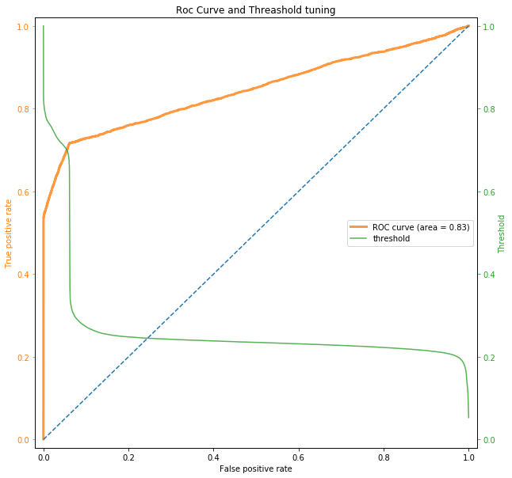
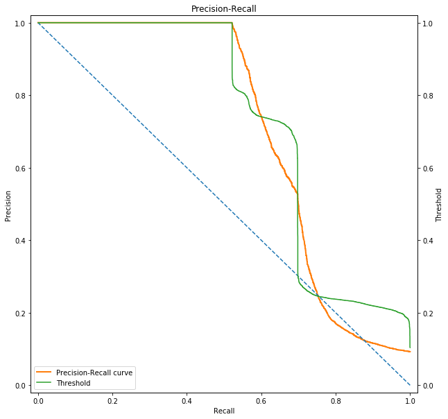
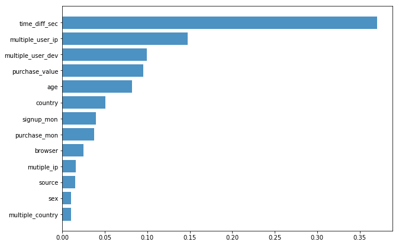

# Identify Fraud
### James Chen

### Data Sanity check
Data for this practice are coming from two table, the fraud data and the ip to country information. Both data are all well structured no miss value appeared, and the numbers are lying in reasonable range.  

### IP address to country name
There are 138846 different ip range in the ip-country table, if we use naive way to check compare target ip with lower and upper bound, the computation will be expensive, with O(M*N). By construct a hash table and apply a bisection search, the time complexity can be redueced to O(M * logN).  
```python
def create_ip_dict(df):
    ip_dict = dict()
    for ix, row in df.iterrows():
        ip = row['lower_bound_ip_address']
        ip_dict[ip] = [row['upper_bound_ip_address'], row['country']]
    return ip_dict


def found_lower_bound(arr, tar, ip_dict):
    '''
    found lower bound of an ip by bisection search
    '''
    if tar > 3758096383 or tar < 16777216:
        return None
    n = len(arr)
    if n == 0:
        return None
    if arr[n/2] == tar:
        return tar
    elif  arr[n/2] < tar:
        upper = ip_dict[arr[n/2]][0]
        if upper >= tar:
            return arr[n/2]
        elif upper < tar:
            return found_lower_bound(arr[n/2 + 1:], tar, ip_dict)
    elif arr[n/2] > tar:
        return found_lower_bound(arr[:n/2], tar, ip_dict)


def get_country(x, ip_df, ip_dict):
    '''
    convert a ip address to country name
    return county name
    '''
    lower_bound = found_lower_bound(ip_df['lower_bound_ip_address']
                                        .values, x, ip_dict)
    if lower_bound in ip_dict:
        return ip_dict[lower_bound][1]

ip_dict = create_ip_dict(ip_df)
fraud['country'] = (fraud['ip_address']
                        .apply(lambda x:
                               get_country(x, ip_df, ip_dict)))
```

### Feature engineer
1. By check the data, i found out a strong indication that if a user make purchase right after sign up account, this user will be a fraud.   
2. IP address and device ID along will be less useful in prediction model, so i tried dig into the relevant features. Consider one device be used on several users or several IPs, this device could be used as fraud. Similarly, count if one ip_address have been used for multiple users or multiple devices.
3. All categorical variable have be transfered to integer.


### Model selection
Since large number of categorical features involved, I decide to use the non-linear tree based models, like random forest and extreme gradient booster, which can natively adapt categorical variable. The data are imbalanced, 90% of data showed negative to fraud. A random under sampling technical have been applied on training set.  
Since the model can not perfectly predict the fraud, the model should be choose based on the the cost of false positive.  
1. If the false positive cost are low, then model can be less precision but higher recall, in which capture as many fraud as possible.  
2. If the false positive cost are high, then model has to be conservative, only predict fraud when possibility is high. At this time, model should be chosen by higher  precision.  
3. If the false negative cost are high, we want less frauds be missed from our detection, so make more positive prediction, and catch as many fraud as posible. Model should be chosen by high recall.  
4. If the false negative cost are low, we want accurately catch fraud and affect less non-fraud users, choose model by high precision.  
5. There are two way to tuning the precision-recall trade off. One is tuning model parameters targeting higher precision/recall, another way is tuning threshold by roc curve or precision recall curve.  


As shown in above roc curve and precision recall curve, the threshold are green lines, the desired ratio of precision / recall can be achieved by choose different threshold.  

### User experience
User experience will be affect by different model selection.
1. for a high precision model, less non-fraud users will be affect by fraud detection and meanwhile more fraud will be missed. User will have better exprience.
2. for a high recall model, more fraud alarm will be made, hence more users will be affect. The user experience will be less comfortable.

### Model interpretation

One import result to choose the ensemble tree based model is the feature importance can be given by the ratio of information explained by a specific variable. In our case, the four most important features are time between sign up and purchase, if a ip have been used by multiple users, if a device have been used by multiple users, and the purchase.  
A typical fraud can be portrayed as: the purchase is made immediately after sign up an account, the ip address have been used by multiple user id, multiple user ids used same device and usually purchase price between 30 and 40.

### Future work
A more dedicate feature engineer should be a applied and explored the higher order interaction between the variables. The model parameters should be fine tuned by the desire metrics.
