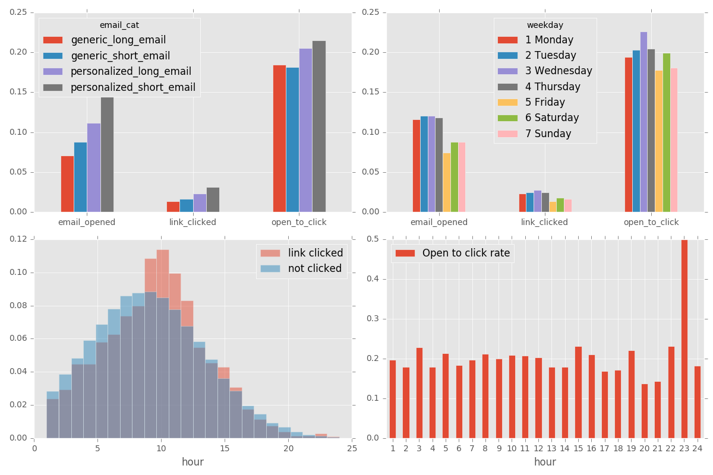
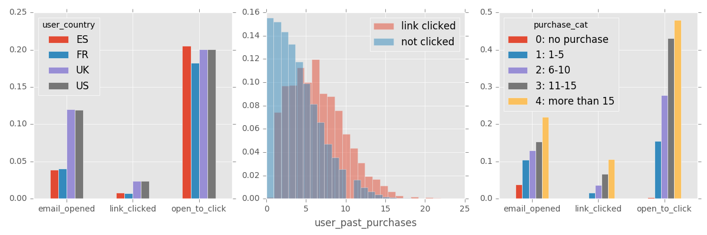

# Marketing Email Campaign -- take home practice 1

## Problems
In this take-home practice, data contain the email information and user information. Our target is to optimize the clicks in emails. For a link to click through, two steps are involved open the email and click the link.  
In data given, the email open rate is 10.35%, and link click rate is 2.07%, email to link click rate is about 20%. Our goal is to improve all those three metrics.

## Data Analysis
### Data Cleanliness
There are 100,000 emails with no empty value. All variables seems in reasonable range. However, 50 of emails shows click without email open, in the case of this take home, which are impossible. Those 50 emails has to be removed before further analysis.

### Email information
* Email_text and Email_version give the information of email contain. In the records, those two variables are both choose even chance. As show in the left upper figure, email_cat is combination of email_text and email_version, personalized-short-email has highest email open rate, highest link-clicked rate and highest click through rate. Also, personalized email are better open and click than generic, and short email are better than long emails.
* hour and weekday give the information of email sending time. The emails are sent equal amount over all weekdays. However, workdays (Monday to Thursday) have higher email open and clicks, especially Wednesday achieve a highest rate.
* The amount of emails sent follows normal distribution, which peaks as 9 am, while the email open and click are peaked as around 12 pm. It is worth mentioning that the peak of open to click rate appears at late night around 23 o'clock.

### User information
* The mails send to users in different country are in a varied ratio, US:UK:ES:FR = 6:2:1:1. The rate of email open are different between english speaking country (US, UK) and other country(ES, FR), however all countries have comparable level of click through rate. The low email open rate in ES and FR may come from culture difference or marketing strategies.
* The user number decayed with higher product purchase number. However, the more product purchased, user are more intending to open mails and click links. The majority links are happened on users with purchase between 5 to 10 products. User has no previous

## Solution
### Approach 1
Simply use the conclusion from EDA, then choose a subgroup of the users. Check the email open rate and link clicked through rate.  
A simple subgroup is:  
email: personalized, short, send only on Monday to Thursday from 8 to 14 o'clock.
user: only with purchase records, from UK and US  
As a result, 22.73% of email opened, 5.21% of link clicked from this subgroup of users.
### Approach 2
#### method
1. Build a two stage classification model to predict the email open and when the mail opened, the link click.
2. make strategies change based on analysis, and generate simulation data.
3. Use model built to check simulation data, and verify the effectiveness of the new strategies.

#### Strategies
1. Instead use equal email_text and email_version, choose large proportion of personalized email and short email.
2. The hourly send emails modified to follow a bimodal normal distribution, which has means at 12 and 23.
3. The daily send emails modified to follow a normal distribution with mean at Wednesday.
4. Increase the portion of US and UK mails
5. modify the user_past_purchases to follow a normal distribution with mean at 12.

#### Result
Prediction model are build based on three method: naive bayes, random forest, and extreme gradient boost, and the open/click rate are average by 5 sets simulation. All three classification models perform rather poorly on any metrics, which produce an alarmingly high amount false positive, hence boost the open/click rate. This simulation result are **NOT** reliable.

In order to check the effectiveness of this strategies, a test similar to above simulation need to be conducted. Choose a group of user based on the strategies described above, separate them into several group, use the strategies above to send the email. Then check if the result is stable and better performance.
