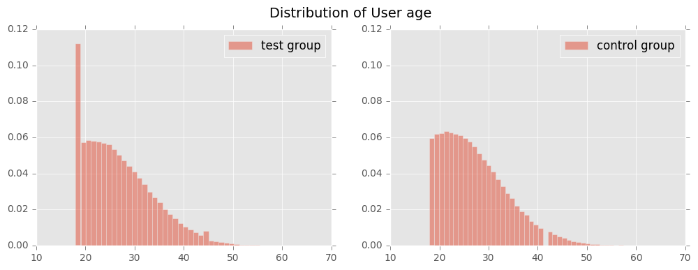
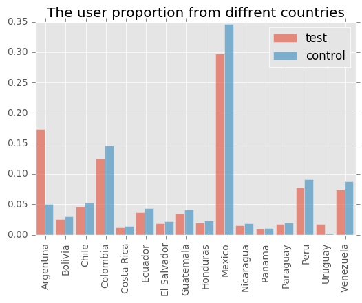

# Spanish Translation
### James Chen


## Sampling
This take-home focus on the A/B test result to compare if the conversion rate have an improvement after sending the user from Latin American a translated version.

The A/B based on the assumption that test and control are randomly selected from the same users groups, meaning the distribution of users should be same. And the proportion of user from different groups should remain same level. The only difference should be the translated version of ads or not translated.

The data is joined two tables by user_id. A few conclusion can be draw by check the sampling method.  
1. User from Spain are only appearing in control set, which is perfect reasonable. But for this test, this part of users should be excluded, since the test object are users from Latin-American.  
2. 454 of user_id appeared in test have no information of sex, age, and country, which should also be excluded from result.
3. by check the proportion of user from different category, this test has excellently balanced the proportion of the user from different group, in following category : date, source, device, browser_language, ads_channel,sex.
4. User age follows the similar distribution, however the proportion users of age 18 are much higher than control group.

5. However, and most importantly, the proportion test and control varied from country to country, especially the Argentina and Uruguay, the proportion are many times different.  


## Test result
The A/B test conclusion can be draw by two-sample one_tail proportional hypothesis test, with the H0: P1 = P2 and Ha: P1>P2, in which P1 is the proportional of conversion in control, and P2 is in test set. Z-score and p_value can be get from following python code.
```python
from scipy.stats import norm
import numpy as np
def two_sample_propotion(x1, x2, n1, n2, tail=1):
    p1 = 1.0 * x1 / n1
    p2 = 1.0 * x2 / n2
    p = 1.0*(x1 + x2)/(n1 + n2)
    se = np.sqrt(p*(1.0 - p)*(1.0/n1 + 1.0/n2))
    print se
    z = (p1 - p2) / se
    if tail == 2:
        pval = 2*(1 - norm.cdf(abs(z)))
    elif tail ==1:
        pval = 1 - norm.cdf(abs(z))
    return z, pval
```
As a result, the all country test result shows a p-value less than 0.05, the test seems showed the translated version are worse. However due to the unbalanced sample draw across the different country, this test result are **unreliable**.  
Look into the result from different country, no country has passed either one-tail or two tail test, the p-value are all larger than 0.05. The test result are **inconclusive**.

## Solution
In order to prevent the same problem happen in the future, a simple test can be done before the A/B test.  
```python
def test_balance(df, threshold):
    '''
    input: df: the panda dataframe content test information
           threshold: the max proportion difference
    '''
    gp_test = df.groupby('test')['user_id'].count()
    country_list = df['country'].unique()
    fail_list = []
    for country in country_list:
        gp_coun = df[df['country']==country].groupby('test')
        gp_coun = gp_coun['user_id'].count()
        gp_coun /= gp_test
        if abs(gp_coun[0] - gp_coun[1]) > threshold:
            fail_list.append(country)
    if len(fail_list) > 0:
        print 'Following country are imbalanced:'
        print ', '.join(country)
        return False
    return True
```
